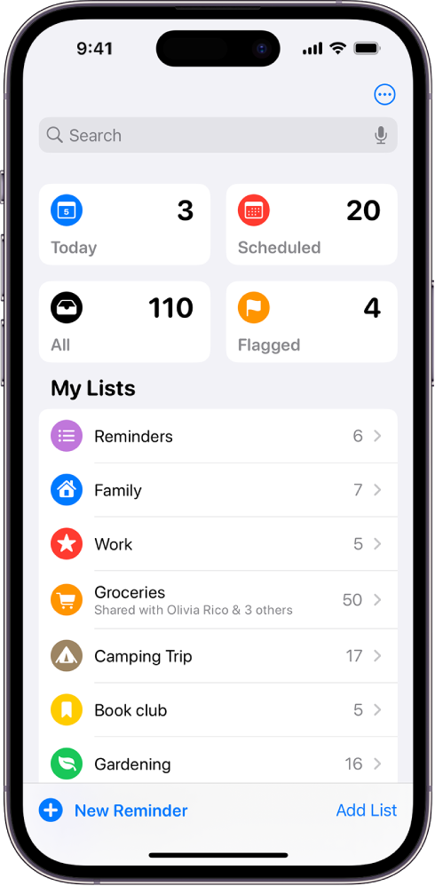

# todos

## Requirements

- Use classes and objects for todos
- Use Javascript to generate DOM (SPA)
- Use webpack to bundle prod, dev versions (webpack merge)
- Separate application logic from DOM-related stuff
- Use webstorage api to store todos
  - Make sure to handle exceptions so that the app doesn't crash with missing data

## Todos:

1. new todo button -> scroll to input modal
2. todos container rerender should be done with animation on 1 sec delay
3. scroll event -> Uncaught TypeError: Cannot read properties of null (reading 'classList')
   at HTMLDocument.<anonymous> (UIController.js:60:1)
4. confirm modal on project delete
5. drag drop
6. Add throttling for scroll event listenr
7. nav\_\_main--item click isn't recognized properly on the edges
8. fix project nav div click when overflowing
9. edit project name -> once is good -> second -> Navbar.js:180
10. order by prio
11. order by schedule

## Use case scenarios

- User should have a default project to which all of their todos are put
- User should be able to create new projects and choose which project their todos go into.
- User should be able to create new todos
- User should be able to view all projects
- User should be able to view all todos in each project (title and duedate, changing color for different priorities)
- User should be able to expand a single todo to see/edit its details
- User should be able to delete a todo

## Suggestions

- Make use of libraries from [npm](https://github.com/date-fns/date-fns)
