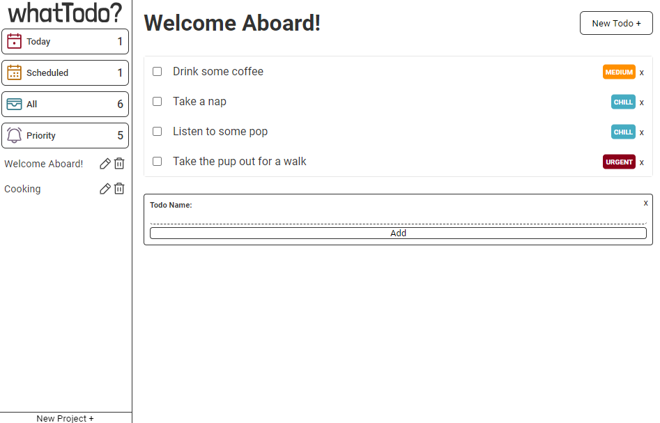

# JavaScript Todo App



Welcome to our JS Todo App. Manage tasks and projects

## Key features

<!-- drag drop gif -->

1. Drag drop todos and move around projects (HTML5 Drag & Drop API)

<!-- rerender gif -->

2. Rerendering of Navbar for counts like todos with priority (JS)

<!-- responsive gif -->

3. Reponsive UI; web, tablet, phone screens supported (Pure CSS3 media queries)
4. Bundlize js, css, assets using webpack for shorter load time
5. Store data in localStorage for data to be saved when browser is closed

## Requirements

- Follow Object Oriented Programming (OOP) paradigm
- Use **ONLY Javascript to generate DOM** (Single Page Application)
- Use **webpack** to bundle prod, dev versions (webpack merge)
- Separate application logic from DOM-related stuff
- Use webstorage api to store todos
  - Make sure to handle exceptions so that the app doesn't crash with missing data
- Modularize CSS modules & JS modules

## File structure

Here's a look at the top-level structure of this project:

```plaintext
tree -L 4 -I 'node_modules'
.
├── README.md
├── dist
│ ├── index.html
│ └── index_bundle.js
├── package-lock.json
├── package.json
├── src
│ ├── assets
│ │ ├── flag-fill.svg
│ │ ├── whatTodo.svg
│ │ └── whatTodoQuestion.svg
│ ├── index.html
│ ├── index.js
│ ├── modules
│ │ ├── controllers
│ │ │ ├── AppController.js
│ │ │ ├── ProjectController.js
│ │ │ ├── StorageController.js
│ │ │ └── TodoController.js
│ │ ├── models
│ │ │ ├── Project.js
│ │ │ └── Todo.js
│ │ ├── styles
│ │ │ ├── base.css
│ │ │ ├── btn.css
│ │ │ ├── completedTodo.css
│ │ │ ├── deleteModal.css
│ │ │ ├── drag.css
│ │ │ ├── generalNav.css
│ │ │ ├── input.css
│ │ │ ├── layout.css
│ │ │ ├── mediaQuery.css
│ │ │ ├── nav.css
│ │ │ ├── projectModal.css
│ │ │ ├── svg.css
│ │ │ ├── todo.css
│ │ │ ├── todoDetailModal.css
│ │ │ ├── todoModal.css
│ │ │ └── variables.css
│ │ ├── utils
│ │ │ └── Helper.js
│ │ └── views
│ │ ├── Components
│ │ └── UIController.js
│ └── styles.css
├── webpack.common.js
├── webpack.dev.js
└── webpack.prod.js

11 directories, 38 files
```

## Use case scenarios

- User should have a default project to which all of their todos are put
- User should be able to create new projects and choose which project their todos go into.
- User should be able to create new todos
- User should be able to view all projects
- User should be able to view all todos in each project (title and duedate, changing color for different priorities)
- User should be able to expand a single todo to see/edit its details
- User should be able to delete a todo

## External Dependencies

- **date-fns** (^3.6.0): Used for handling dates and times.
- **html-webpack-plugin** (^5.6.0): Simplifies creation of HTML files to serve webpack bundles.
- **style-loader** (^3.3.4): Injects CSS into the DOM.
- **uniqid** (^5.4.0): Generates unique IDs for elements.
- **webpack** (^5.90.3),
- **css-loader** (^6.10.0): Allows webpack to process CSS files.
- **svg-inline-loader** (^0.8.2): Imports SVG files as modules in webpack context.
- **webpack-cli** (^5.1.4),
- **webpack-merge** (^5.10.0): Tools for bundling JavaScript applications and managing configurations.
