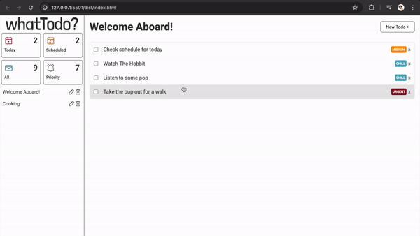

# JavaScript Todo App


Welcome to our JS Todo App (**whatTodo?**), a tool for managing tasks and projects with ease through a web interface.

## Key Features

<!-- drag drop gif -->

### 1. Drag & drop



<!-- rerender gif -->

### 2. Dynamic rerendering


<!-- responsive gif -->

### 3. Reponsive UI


### 4. Webpack Bundling

### 5. Store data in localStorage

### 6. Dynamically generate DOM (SPA)

## Getting Started

```bash
git clone https://github.com/taewookim02/todos.git

cd todos

npm install
```

After npm dependencies have been installed, you can run `live-server` on the `/dist` directory.

Or

Simply open the `index.html` inside `/dist` directory in your browser.

## File structure

Here's a look at the top-level structure of this project:

```plaintext
tree -L 5 -I 'node_modules'
.
├── README.md
├── dist
│   ├── index.html
│   └── index_bundle.js
├── package-lock.json
├── package.json
├── src
│   ├── assets
│   │   ├── flag-fill.svg
│   │   ├── whatTodo.svg
│   │   └── whatTodoQuestion.svg
│   ├── index.html
│   ├── index.js
│   ├── modules
│   │   ├── controllers
│   │   │   ├── AppController.js
│   │   │   ├── ProjectController.js
│   │   │   ├── StorageController.js
│   │   │   └── TodoController.js
│   │   ├── models
│   │   │   ├── Project.js
│   │   │   └── Todo.js
│   │   ├── styles
│   │   │   ├── base.css
│   │   │   ├── btn.css
│   │   │   ├── completedTodo.css
│   │   │   ├── deleteModal.css
│   │   │   ├── drag.css
│   │   │   ├── generalNav.css
│   │   │   ├── input.css
│   │   │   ├── layout.css
│   │   │   ├── mediaQuery.css
│   │   │   ├── nav.css
│   │   │   ├── projectModal.css
│   │   │   ├── svg.css
│   │   │   ├── todo.css
│   │   │   ├── todoDetailModal.css
│   │   │   ├── todoModal.css
│   │   │   └── variables.css
│   │   ├── utils
│   │   │   └── Helper.js
│   │   └── views
│   │       ├── Components
│   │       │   ├── Button.js
│   │       │   ├── Component.js
│   │       │   ├── DeleteConfirmModal.js
│   │       │   ├── Modal.js
│   │       │   ├── Navbar.js
│   │       │   ├── Todo.js
│   │       │   ├── TodoDetailModal.js
│   │       │   └── TodoModal.js
│   │       └── UIController.js
│   └── styles.css
├── webpack.common.js
├── webpack.dev.js
└── webpack.prod.js

11 directories, 46 files
```

## Use case scenarios

- User should have a default project to which all of their todos are put
- User should be able to create new projects and choose which project their todos go into.
- User should be able to create new todos
- User should be able to view all projects
- User should be able to view all todos in each project (title and duedate, changing color for different priorities)
- User should be able to expand a single todo to see/edit its details
- User should be able to delete a todo

## Requirements

- Follow Object Oriented Programming (OOP) paradigm
- Use **ONLY Javascript to generate DOM** (Single Page Application)
- Use **webpack** to bundle prod, dev versions (webpack merge)
- Separate application logic from DOM-related stuff
- Use webstorage api to store todos
  - Make sure to handle exceptions so that the app doesn't crash with missing data

## External Dependencies

<table border="1">
  <tr>
    <td>date-fns (^3.6.0)</td>
    <td>Used for handling dates and times.</td>
  </tr>
  <tr>
    <td>html-webpack-plugin (^5.6.0)</td>
    <td>Simplifies creation of HTML files to serve webpack bundles.</td>
  </tr>
  <tr>
    <td>style-loader (^3.3.4)</td>
    <td>Injects CSS into the DOM. (webpack module)</td>
  </tr>
  <tr>
    <td>uniqid (^5.4.0)</td>
    <td>Generates unique IDs for elements.</td>
  </tr>
  <tr>
    <td>webpack (^5.90.3)</td>
    <td></td>
  </tr>
  <tr>
    <td>css-loader (^6.10.0)</td>
    <td>Allows webpack to process CSS files. (webpack module)</td>
  </tr>
  <tr>
    <td>svg-inline-loader (^0.8.2)</td>
    <td>Imports SVG files as modules in webpack context. (webpack module)</td>
  </tr>
  <tr>
    <td>webpack-cli (^5.1.4)</td>
    <td></td>
  </tr>
  <tr>
    <td>webpack-merge (^5.10.0)</td>
    <td>Tools for bundling JavaScript applications and managing configurations.</td>
  </tr>
</table>

## Improvements

- Modularization
- DRY principle
- Clean code
- Following a pattern (currently I tried to follow the MVC pattern as best as I could)
- Untangle Spaghetti code
- Better usage of CSS variables
  - Add dark/light mode

## Difficulties

Whilst using static html structure to create DOM elements is solid, dynamically generating almost all elements was difficult due to many reasons. Such as:

- High dependence/importance of which elements render first
- Following separation of concerns being more difficult (e.g. which methods should go into which component file?)
- Difficulties in following OOP principles' best practices when components and its interactions are involved
- Not having much experience with SPA, MVC patterns, and separation of concerns
- Facing the spaghetti code generated by myself 1 month earlier

## Lesson Learned & Thoughts

- Strongly following a pattern/architecture (e.g. Nth tier architecture, MVC pattern, Singleton pattern, etc...) is a very good idea because not following to do so will make the code more complex, thus lengthening the time to ship the app.
- It is a very good idea to make code DRY, with semantic function names to make code more readable..
- To go look at conventions or ways of managing states (like isModalOpen, etc) because managing states like so with vanilla JS was challenging
- That when to use static methods vs non static methods is a weak point.
- This encompasses the above lessons learnt, but I now get why people read books like "Clean Code" because wow it was hard to put the spaghetti code altogether to make it work.
- Single Page Applications, at least in my case (pure Vanilla JS) relies heavily on the parent DOM node and the sequence of which DOM gets appended to is crucial.
- Need need need to see how other projects handle dynamically generated components (e.g. todo creation modal) and how the interactions associated with said components are handled. In best practices, are they handled within the TodoModal.js component? Or are those interactions handled on some parent Controller that makes use of TodoModal rendering? Many questions, can't wait to see how people using React handles this
